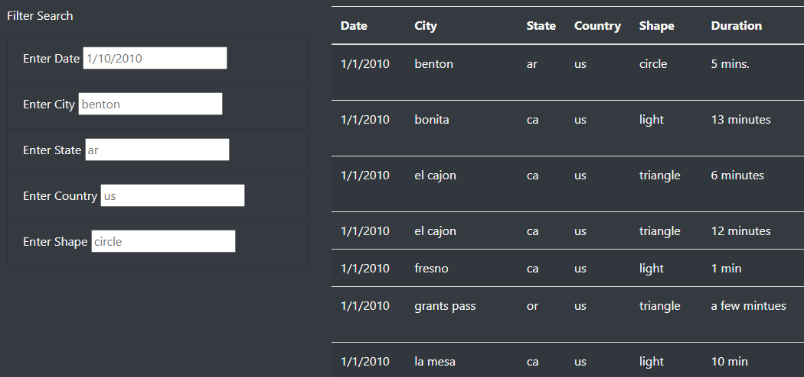
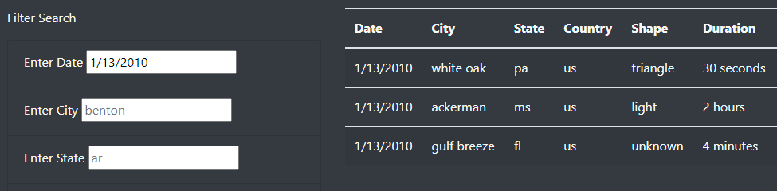
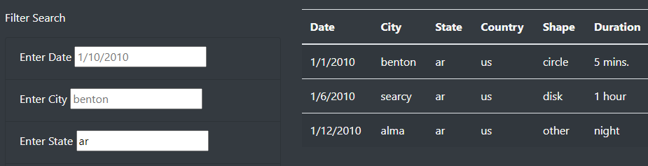
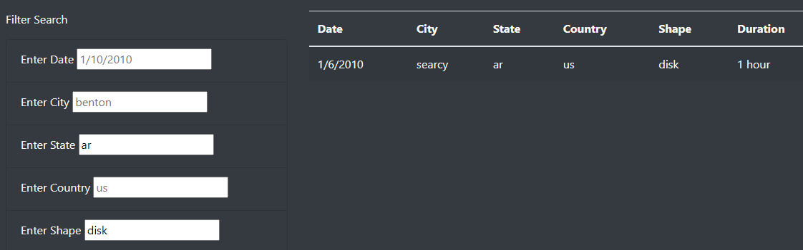

# UFO Sightings Challenge

## Overview

The purpose of this analysis was to take data from UFO sightings and display it on a website that allows for the filtering of data by a number of criteria. This allows users to narrow down their search and perform more focused analysis of these UFO sightings.

## Results

To use this webpage, simply enter the date, city, state, country, or shape for which you wish to search. Once you type in any of the filter boxes, the table will automatically be filtered by whatever you input. To change or remove your filters, simply edit or delete the text in the filter boxes. For example, below is an image of the table without any filters applied (comments column omitted to lower image size):

If you want to see only UFO sightings from January 13, 2010, type "1/13/2010" in the date filter box.

If you want to see only UFO sightings in Arkansas, type "AR" in the state filter box.

This can be done for one or multiple criteria at a time.

## Summary

One drawback of this webpage is a lack of automation in terms of new UFO sighting data. As it stands, the only data loaded into the table is from a 2-week span in January 2010. If condcuting a modern-day study, much more data would be necessary. One possible way to counteract this shortcoming would be to provide a place for a user to manually enter new data that will be loaded into the table. This would allow for easier collaboration and updating of the table. Another improvement to this website could be a space for studies that use the website's data to be published. If the purpose of collecting this data is to study the behaviors and appearances of UFOs, researchers will likely publishing their findings in articles or journals. These publications could be collected on the website to give users more insight into UFO sightings.
